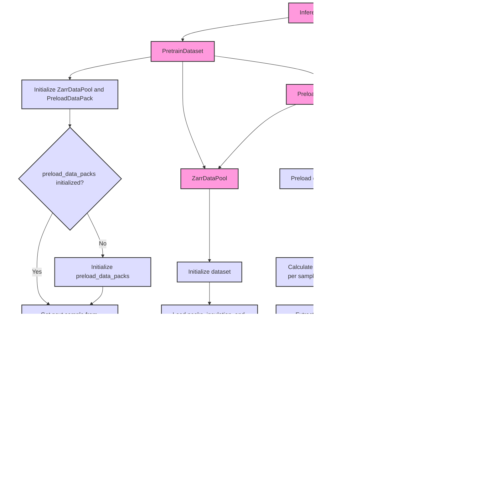
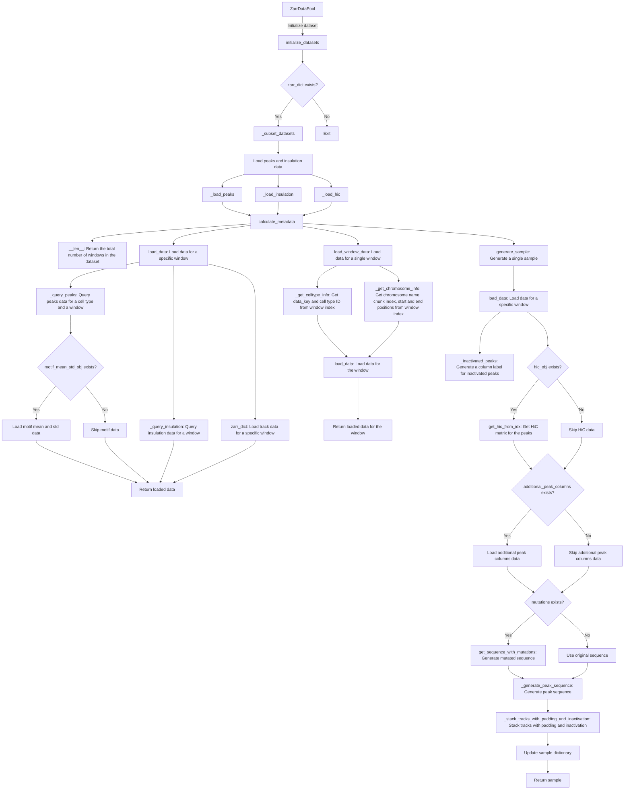
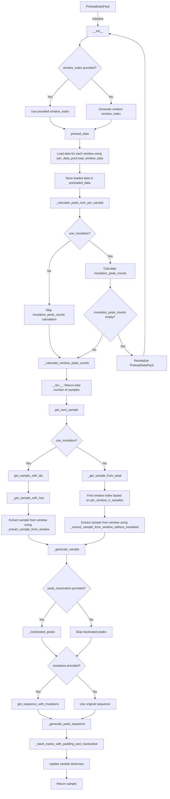
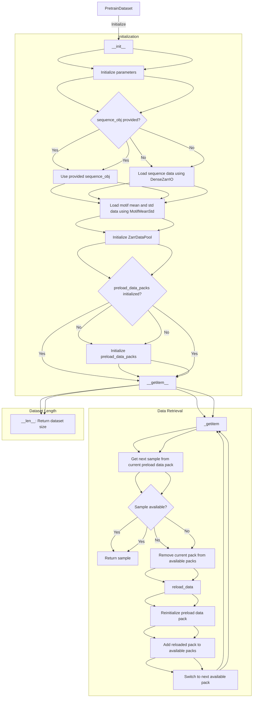
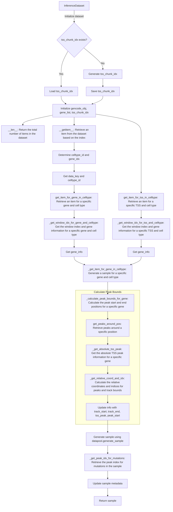

# Dataset

```mermaid
flowchart TD
    A[PretrainDataset]:::foo --> B[Initialize ZarrDataPool and PreloadDataPack]:::method
    B --> C{preload_data_packs initialized?}:::method
    C -->|Yes| D[Get next sample from current preload data pack]:::method
    C -->|No| E[Initialize preload_data_packs]:::method
    E --> D
    D --> F{Sample available?}:::method
    F -->|Yes| G[Return sample]:::method
    F -->|No| H[Reload data pack and switch to next available pack]:::method
    H --> D
    
    I[ZarrDataPool]:::foo --> J[Initialize dataset]:::method
    J --> K[Load peaks, insulation, and HiC data]:::method
    K --> L[Generate samples]:::method
    
    M[PreloadDataPack]:::foo --> N[Preload data for windows]:::method
    N --> O[Calculate number of peaks per sample and per window]:::method
    O --> P[Extract samples from windows]:::method
    
    Q[InferenceDataset]:::foo --> R[Generate TSS chunk index]:::method
    R --> S[Calculate peak bounds for a gene]:::method
    S --> T[Retrieve samples for a specific gene or TSS in a given cell type]:::method
    
    A --> I
    A --> M
    M --> I
    Q --> A
    
    classDef foo fill:#f9d,stroke:#333,stroke-width:2px
    classDef method fill:#ddf,stroke:#333,stroke-width:2px,color:#333
```
## ZarrDataPool

```mermaid
graph TD
    A[ZarrDataPool] -->|Initialize dataset| B[initialize_datasets]
    B --> C{zarr_dict exists?}
    C -->|Yes| D[_subset_datasets]
    D --> E[Load peaks and insulation data]
    E --> F[_load_peaks]
    E --> G[_load_insulation]
    E --> H[_load_hic]
    C -->|No| I[Exit]
    F --> J[calculate_metadata]
    G --> J
    H --> J
    J --> K[__len__: Return the total number of windows in the dataset]
    J --> L[load_data: Load data for a specific window]
    L --> M[_query_peaks: Query peaks data for a cell type and a window]
    L --> N[_query_insulation: Query insulation data for a window]
    L --> O[zarr_dict: Load track data for a specific window]
    M --> P{motif_mean_std_obj exists?}
    P -->|Yes| Q[Load motif mean and std data]
    P -->|No| R[Skip motif data]
    Q --> S[Return loaded data]
    R --> S
    N --> S
    O --> S
    J --> T[load_window_data: Load data for a single window]
    T --> U[_get_celltype_info: Get data_key and cell type ID from window index]
    T --> V[_get_chromosome_info: Get chromosome name, chunk index, start and end positions from window index]
    U --> W[load_data: Load data for the window]
    V --> W
    W --> X[Return loaded data for the window]
    J --> Y[generate_sample: Generate a single sample]
    Y --> Z[load_data: Load data for a specific window]
    Z --> AA[_inactivated_peaks: Generate a column label for inactivated peaks]
    Z --> AB{hic_obj exists?}
    AB -->|Yes| AC[get_hic_from_idx: Get HiC matrix for the peaks]
    AB -->|No| AD[Skip HiC data]
    AC --> AE{additional_peak_columns exists?}
    AD --> AE
    AE -->|Yes| AF[Load additional peak columns data]
    AE -->|No| AG[Skip additional peak columns data]
    AF --> AH{mutations exists?}
    AG --> AH
    AH -->|Yes| AI[get_sequence_with_mutations: Generate mutated sequence]
    AH -->|No| AJ[Use original sequence]
    AI --> AK[_generate_peak_sequence: Generate peak sequence]
    AJ --> AK
    AK --> AL[_stack_tracks_with_padding_and_inactivation: Stack tracks with padding and inactivation]
    AL --> AM[Update sample dictionary]
    AM --> AN[Return sample]
```
## PreloadDataPack

```mermaid
graph TD
    A[PreloadDataPack] -->|Initialize| B[__init__]
    B --> C{window_index provided?}
    C -->|Yes| D[Use provided window_index]
    C -->|No| E[Generate random window_index]
    D --> F[preload_data]
    E --> F
    F --> G[Load data for each window using zarr_data_pool.load_window_data]
    G --> H[Store loaded data in preloaded_data]
    H --> I[_calculate_peak_num_per_sample]
    I --> J{use_insulation?}
    J -->|Yes| K[Calculate insulation_peak_counts]
    J -->|No| L[Skip insulation_peak_counts calculation]
    K --> M{insulation_peak_counts empty?}
    L --> N[_calculate_window_peak_counts]
    M -->|Yes| O[Reinitialize PreloadDataPack]
    M -->|No| N
    O --> B
    N --> P[__len__: Return total number of samples]
    P --> Q[get_next_sample]
    Q --> R{use_insulation?}
    R -->|Yes| S[get_sample_with_idx]
    R -->|No| T[_get_sample_from_peak]
    S --> U[_get_sample_with_key]
    T --> V[Find window index based on per_window_n_samples]
    U --> W[Extract sample from window using _extract_sample_from_window]
    V --> X[Extract sample from window using _extract_sample_from_window_without_insulation]
    W --> Y[_generate_sample]
    X --> Y
    Y --> Z{peak_inactivation provided?}
    Z -->|Yes| AA[_inactivated_peaks]
    Z -->|No| AB[Skip inactivated peaks]
    AA --> AC{mutations provided?}
    AB --> AC
    AC -->|Yes| AD[get_sequence_with_mutations]
    AC -->|No| AE[Use original sequence]
    AD --> AF[_generate_peak_sequence]
    AE --> AF
    AF --> AG[_stack_tracks_with_padding_and_inactivation]
    AG --> AH[Update sample dictionary]
    AH --> AI[Return sample]
```
## PretrainDataset

```mermaid
graph TD
    A[PretrainDataset] -->|Initialize| B[__init__]
    B --> C[Initialize parameters]
    C --> D{sequence_obj provided?}
    D -->|Yes| E[Use provided sequence_obj]
    D -->|No| F[Load sequence data using DenseZarrIO]
    E --> G[Load motif mean and std data using MotifMeanStd]
    F --> G
    G --> H[Initialize ZarrDataPool]
    H --> I{preload_data_packs initialized?}
    I -->|Yes| J[__getitem__]
    I -->|No| K[Initialize preload_data_packs]
    K --> J
    J --> L[_getitem]
    L --> M[Get next sample from current preload data pack]
    M --> N{Sample available?}
    N -->|Yes| O[Return sample]
    N -->|No| P[Remove current pack from available packs]
    P --> Q[reload_data]
    Q --> R[Reinitialize preload data pack]
    R --> S[Add reloaded pack to available packs]
    S --> T[Switch to next available pack]
    T --> L
    J --> U[__len__: Return dataset size]
    
    subgraph Initialization
        B --> C
        C --> D
        D -->|Yes| E
        D -->|No| F
        E --> G
        F --> G
        G --> H
        H --> I
        I -->|Yes| J
        I -->|No| K
        K --> J
    end
    
    subgraph Data Retrieval
        J --> L
        L --> M
        M --> N
        N -->|Yes| O
        N -->|No| P
        P --> Q
        Q --> R
        R --> S
        S --> T
        T --> L
    end
    
    subgraph Dataset Length
        J --> U
    end
```
## InferenceDataset

```mermaid
graph TD
    A[InferenceDataset] -->|Initialize dataset| B{tss_chunk_idx exists?}
    B -->|Yes| C[Load tss_chunk_idx]
    B -->|No| D[Generate tss_chunk_idx]
    D --> E[Save tss_chunk_idx]
    C --> F[Initialize gencode_obj, gene_list, tss_chunk_idx]
    E --> F
    F --> G[__len__: Return the total number of items in the dataset]
    F --> H[__getitem__: Retrieve an item from the dataset based on the index]
    H --> I[Determine celltype_id and gene_idx]
    I --> J[Get data_key and celltype_id]
    J --> K[get_item_for_gene_in_celltype: Retrieve an item for a specific gene and cell type]
    K --> L[_get_window_idx_for_gene_and_celltype: Get the window index and gene information for a specific gene and cell type]
    L --> M[Get gene_info]
    M --> N[_get_item_for_gene_in_celltype: Generate a sample for a specific gene and cell type]
    N --> O[_calculate_peak_bounds_for_gene: Calculate the peak start and end positions for a specific gene]
    
    subgraph Calculate Peak Bounds
        O --> P[get_peaks_around_pos: Retrieve peaks around a specific position]
        P --> Q[_get_absolute_tss_peak: Get the absolute TSS peak information for a specific gene]
        Q --> R[_get_relative_coord_and_idx: Calculate the relative coordinates and indices for peaks and track bounds]
        R --> S[Update info with track_start, track_end, tss_peak, peak_start]
    end
    
    S --> T[Generate sample using datapool.generate_sample]
    T --> U[_get_peak_idx_for_mutations: Retrieve the peak index for mutations in the sample]
    U --> V[Update sample metadata]
    V --> W[Return sample]
    F --> X[get_item_for_tss_in_celltype: Retrieve an item for a specific TSS and cell type]
    X --> Y[_get_window_idx_for_tss_and_celltype: Get the window index and gene information for a specific TSS and cell type]
    Y --> Z[Get gene_info]
    Z --> N
```